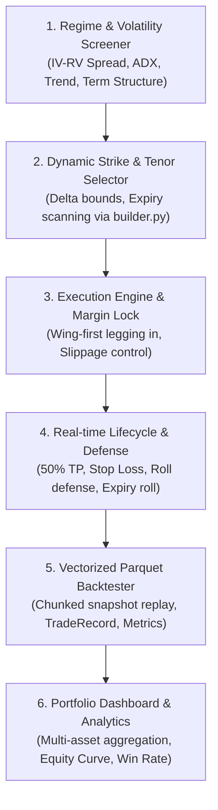

# BOT-000: Master Multi-Strategy Options Bots Architecture & Roadmap

**Status:** backlog  
**Target:** `main`  
**Reference Implementations:**
- [IronCondorBot](file:///Users/hoangviet/Flowsurface/crypto_options_desk_mcp/src/options_lib/strategy/iron_condor_bot.py)
- [IronCondorBacktestEngine](file:///Users/hoangviet/Flowsurface/crypto_options_desk_mcp/src/options_lib/strategy/iron_condor_backtest.py)
- [Multi-Asset Portfolio Runner](file:///Users/hoangviet/Flowsurface/crypto_options_desk_mcp/scripts/run_multi_asset_portfolio_backtest.py)

---

## 1. Executive Summary & Strategy Matrix

Dự án phát triển danh mục các bot giao dịch Options tự động trên Bybit & Deribit, kế thừa toàn bộ kiến trúc 6 lớp đã được chuẩn hóa và kiểm chứng thành công từ **Iron Condor Bot** (BOT-002, BOT-003, BOT-005).

| Issue Code | Chiến lược Options | Bias thị trường | Cơ chế sinh lời chính | Rủi ro chính | Tenor mục tiêu (DTE) |
| :--- | :--- | :--- | :--- | :--- | :--- |
| **BOT-002** | **Iron Condor** *(Đã hoàn thành)* | Neutral / Range-bound | Theta decay + IV Crush | Đột phá 2 đầu biên | 7 – 16 ngày |
| **BOT-006** | **The Wheel (CSP + Covered Call)** | Bullish / Accumulation | Premium thu về + Chiết khấu mua Spot | Spot sụt giảm kéo dài | 7 – 21 ngày |
| **BOT-007** | **Vertical Credit Spreads** | Directional (Bullish/Bearish) | Trend following + Defined risk credit | Đảo chiều xu hướng | 5 – 14 ngày |
| **BOT-008** | **Iron Butterfly** | Low Vol / Pinning ATM | Bán Straddle ATM giá trị cực cao | Giá biến động rời xa strike ATM | 3 – 10 ngày |
| **BOT-009** | **Calendar & Diagonal Spreads** | Neutral / Term Structure | Chênh lệch tốc độ suy hao Theta giữa 2 kỳ hạn | IV đảo chiều (Backwardation) | Bán 7-10d, Mua 30-60d |
| **BOT-010** | **Long Straddle / Strangle** | Volatile / Catalyst Breakout | Mua bùng nổ Vega & Gamma khi IV mở rộng | Bị bào mòn Theta khi giá đi ngang | 7 – 21 ngày |

---

## 2. Kiến Trúc Chuẩn 6 Lớp Cho Mọi Bot (The Blueprint)

Mỗi chiến lược bot khi xây dựng bắt buộc phải tuân thủ nghiêm ngặt 6 module cốt lõi:

1. **Regime Screener (`screener.py` / `analyzer.py`):**
   - Đánh giá tương quan Biến động thực tế (Realized Volatility - RV) và Biến động hàm ý (Implied Volatility - IV).
   - Kiểm tra bộ lọc xu hướng (Trend indicators) phù hợp với từng chiến lược.
2. **Dynamic Strike Selector:**
   - Tự động lọc các hợp đồng thỏa mãn ngưỡng Delta, DTE từ options chain trực tiếp hoặc snapshot.
   - Sử dụng định nghĩa chuẩn trong [STRATEGY_TEMPLATES](file:///Users/hoangviet/Flowsurface/crypto_options_desk_mcp/src/options_lib/strategy/builder.py#L27).
3. **Execution Engine & Margin Lock:**
   - Cơ chế Legging-in bảo vệ tài khoản: Mua chân phòng hộ trước để chốt chặn biên độ ký quỹ (margin ceiling), bán chân thu phí sau.
   - Hỗ trợ cả 2 chế độ: **PaperBroker** (mô phỏng khớp lệnh thực tế) và **Bybit V5 Live API**.
4. **Lifecycle Manager & Defensive Adjustments:**
   - Quy tắc chốt lời sớm (Early Take Profit) để quay vòng vốn nhanh.
   - Quy tắc dừng lỗ chủ động và phòng thủ (Rolling untested side, roll out in time).
5. **Backtest Engine trên dữ liệu Parquet:**
   - Tái hiện lại từng chu kỳ giao dịch trên dữ liệu lịch sử nén Parquet (Deribit / Bybit).
   - Đưa ra các chỉ số: Total Trades, Win Rate, Profit Factor, Sharpe Ratio, Max Drawdown USD / %.
6. **Multi-Asset Portfolio Integration & Dashboard:**
   - Khả năng chạy song song trên nhiều tài sản (BTC, ETH, SOL, DOGE, MNT, XRP).
   - Xuất dữ liệu thống kê JSON và render báo cáo hình ảnh trực quan qua Playwright.

---

## 3. Lộ Trình Triển Khai Chi Tiết (Implementation Roadmap)

1. **Phase 1: Cashflow Yield & Directional Momentum**
   - [x] [BOT-006: The Wheel Strategy Bot](file:///Users/hoangviet/Flowsurface/crypto_options_desk_mcp/docs/issues/bot-006-wheel-strategy-bot.md) *(Hoàn thành: 1,845 trades backtest, Win Rate 99.8%, PnL +$153,902)*
   - [x] [BOT-007: Directional Vertical Credit Spreads Engine](file:///Users/hoangviet/Flowsurface/crypto_options_desk_mcp/docs/issues/bot-007-vertical-credit-spreads-engine.md) *(Hoàn thành: 1,273 trades backtest, Win Rate 98.8%, PnL +$21,089)*
2. **Phase 2: High-Yield Pinning & Term Structure Arbitrage**
   - [x] [BOT-008: Dynamic Iron Butterfly Strategy Engine](file:///Users/hoangviet/Flowsurface/crypto_options_desk_mcp/docs/issues/bot-008-iron-butterfly-strategy-engine.md) *(Hoàn thành: 940 trades backtest, Win Rate 97.8%, PnL +$102,439)*
   - [ ] [BOT-009: Calendar & Diagonal Spread Strategy Engine](file:///Users/hoangviet/Flowsurface/crypto_options_desk_mcp/docs/issues/bot-009-calendar-spread-strategy-engine.md) *(Tiếp theo)*
3. **Phase 3: Long Volatility & Portfolio Risk Allocation**
   - [ ] [BOT-010: Long Volatility Straddle & Strangle Engine](file:///Users/hoangviet/Flowsurface/crypto_options_desk_mcp/docs/issues/bot-010-long-volatility-straddle-strangle-engine.md)
   - [ ] Cross-Strategy Capital Allocator & Combined Desk Dashboard.

