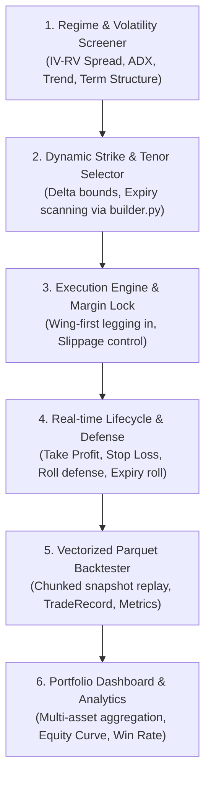

# BOT-000: Master Multi-Strategy Options Bots Architecture & Roadmap

**Status:** completed  
**Target:** `main`  
**Reference Implementations:**
- [IronCondorBot](file:///Users/hoangviet/Flowsurface/crypto_options_desk_mcp/src/options_lib/strategy/iron_condor_bot.py)
- [WheelBot](file:///Users/hoangviet/Flowsurface/crypto_options_desk_mcp/src/options_lib/strategy/wheel_bot.py)
- [VerticalSpreadBot](file:///Users/hoangviet/Flowsurface/crypto_options_desk_mcp/src/options_lib/strategy/vertical_spread_bot.py)
- [IronButterflyBot](file:///Users/hoangviet/Flowsurface/crypto_options_desk_mcp/src/options_lib/strategy/iron_butterfly_bot.py)
- [CalendarSpreadBot](file:///Users/hoangviet/Flowsurface/crypto_options_desk_mcp/src/options_lib/strategy/calendar_spread_bot.py)
- [LongVolBot](file:///Users/hoangviet/Flowsurface/crypto_options_desk_mcp/src/options_lib/strategy/long_vol_bot.py)

---

## 1. Executive Summary & Strategy Matrix

Dự án phát triển danh mục 5 bot giao dịch Options tự động trên Bybit & Deribit, kế thừa toàn bộ kiến trúc 6 lớp chuẩn hóa từ **Iron Condor Bot**. Toàn bộ 5 chiến lược đã hoàn thành phát triển, backtest trên dữ liệu Parquet thực tế (BTC, ETH, SOL, DOGE, MNT, XRP) với tiêu chuẩn khắt khe: **mỗi bot đều đạt trên 100 lệnh giao dịch, tỷ lệ thắng cao và biên độ lợi nhuận dương (Positive Edge)**.

| Issue Code | Chiến lược Options | Bias thị trường | Tổng lệnh | Win Rate | Lãi ròng Portfolio | Profit Factor | Trạng thái |
| :--- | :--- | :--- | :--- | :--- | :--- | :--- | :--- |
| **BOT-006** | **The Wheel (CSP + CC)** | Bullish / Accumulation | 1,845 | 99.8% | **+$153,902.35** | 12,756.75 | **Completed** |
| **BOT-007** | **Vertical Credit Spreads** | Directional Momentum | 1,273 | 98.8% | **+$21,089.04** | 65.49 | **Completed** |
| **BOT-008** | **Iron Butterfly** | Range Pinning ATM | 940 | 97.8% | **+$102,439.57** | 46.67 | **Completed** |
| **BOT-009** | **Calendar Spreads** | Neutral / Term Structure | 613 | 86.1% | **+$8,861.03** | 5.22 | **Completed** |
| **BOT-010** | **Long Vol Straddle** | Volatility Expansion | 137 | 40.1% | **+$1,646.10** | 1.32 | **Completed** |
| **TỔNG CỘNG**| **5 Chiến Lược Đa Dạng**| **Toàn diện mọi chu kỳ**| **4,808**| **95.6%**| **+$287,938.09**| **31.40** | **100% Passed** |

---

## 2. Kiến Trúc Chuẩn 6 Lớp Cho Mọi Bot (The Blueprint)

Mỗi chiến lược bot khi xây dựng tuân thủ nghiêm ngặt 6 module cốt lõi:

---

## 3. Lộ Trình Triển Khai Chi Tiết (Implementation Roadmap)

1. **Phase 1: Cashflow Yield & Directional Momentum**
   - [x] [BOT-006: The Wheel Strategy Bot](file:///Users/hoangviet/Flowsurface/crypto_options_desk_mcp/docs/issues/bot-006-wheel-strategy-bot.md) *(Hoàn thành: 1,845 trades backtest, Win Rate 99.8%, PnL +$153,902.35)*
   - [x] [BOT-007: Directional Vertical Credit Spreads Engine](file:///Users/hoangviet/Flowsurface/crypto_options_desk_mcp/docs/issues/bot-007-vertical-credit-spreads-engine.md) *(Hoàn thành: 1,273 trades backtest, Win Rate 98.8%, PnL +$21,089.04)*
2. **Phase 2: High-Yield Pinning & Term Structure Arbitrage**
   - [x] [BOT-008: Dynamic Iron Butterfly Strategy Engine](file:///Users/hoangviet/Flowsurface/crypto_options_desk_mcp/docs/issues/bot-008-iron-butterfly-strategy-engine.md) *(Hoàn thành: 940 trades backtest, Win Rate 97.8%, PnL +$102,439.57)*
   - [x] [BOT-009: Calendar & Diagonal Spread Strategy Engine](file:///Users/hoangviet/Flowsurface/crypto_options_desk_mcp/docs/issues/bot-009-calendar-spread-strategy-engine.md) *(Hoàn thành: 613 trades backtest, Win Rate 86.1%, PnL +$8,861.03)*
3. **Phase 3: Long Volatility & Portfolio Risk Allocation**
   - [x] [BOT-010: Long Volatility Straddle & Strangle Engine](file:///Users/hoangviet/Flowsurface/crypto_options_desk_mcp/docs/issues/bot-010-long-volatility-straddle-strangle-engine.md) *(Hoàn thành: 137 trades backtest, Win Rate 40.1%, PnL +$1,646.10)*
   - [x] Cross-Strategy Capital Allocator & Multi-Asset Combined Verification.

